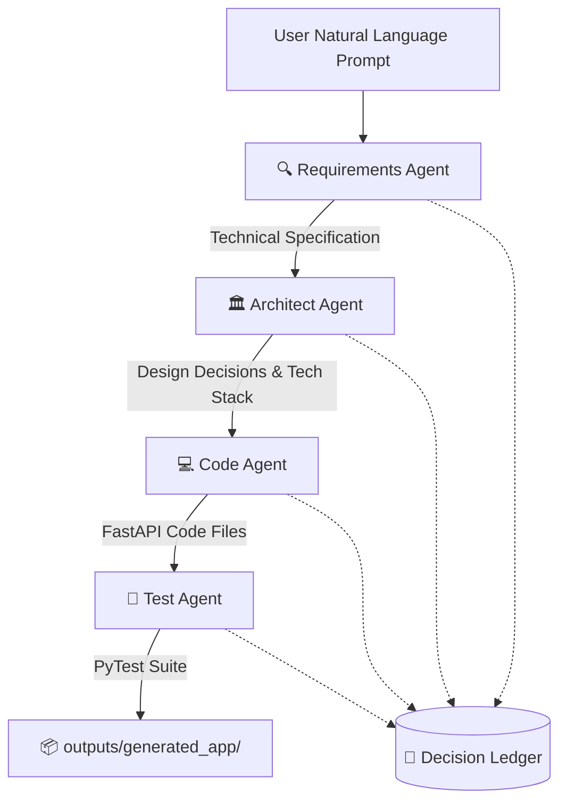

# ARIA-Lite: Autonomous Software Architect
### Autonomous Resilient Intelligence Architecture — DevHack 2026 | Team INITIATORS

**ARIA-Lite** is a multi-agent system designed to act as an autonomous software architect. By taking a natural language prompt describing a software project, it orchestrates a pipeline of specialized agents powered by **Groq Cloud LLMs (Llama 3.3)** to draft technical specifications, design architectural plans, generate clean FastAPI application code, write test suites, and log decisions in a ledger.

The application features a clean, responsive web interface built using **Streamlit**.

---

## 🎨 System Architecture & Agent Roles

The pipeline runs through four specialized agents coordinated by the `ARIAOrchestrator`, with each decision audited inside a central ledger:



### 1. 🔍 Requirements Agent
Converts unstructured prompts into a structured technical specification JSON containing:
*   Project name and detailed descriptions.
*   Required REST API endpoints (methods, paths, and behaviors).
*   Data models and field schemas (names, types, required flags).
*   Non-functional requirements and confidence scores.

### 2. 🏛️ Architect Agent
Analyzes the specification to make design choices:
*   Selects appropriate databases (e.g., SQLite, PostgreSQL) and patterns.
*   Determines API styles, deployment targets, and cloud infrastructures.
*   Documents technical reasoning, trade-offs, and alternative architectures.

### 3. 💻 Code Agent
Translates the specification and architectural design into functional Python files:
*   Generates a fully implemented FastAPI web application.
*   Utilizes ORMs like SQLAlchemy for database interactions.
*   Saves the code to `outputs/generated_app/`.

### 4. 🧪 Test Agent
Drafts a comprehensive test suite targeting all generated endpoints:
*   Uses `pytest` and `httpx.AsyncClient` for asynchronous API testing.
*   Creates local databases for isolated test contexts.
*   Saves tests to `outputs/generated_app/test_app.py`.

### 5. 📔 Decision Ledger
Maintains an audit ledger recording:
*   Every design and programming decision made by each agent.
*   Justifications, confidence ratings, and timestamps.
*   Alternatives that were considered but rejected.
*   Allows downloading the complete trail as a `decision_ledger.json` file.

---

## 🛠️ Technology Stack

*   **Orchestration & Agent LLM**: LangChain, Groq API (`llama-3.3-70b-versatile`)
*   **Web Dashboard UI**: Streamlit
*   **Target Application Stack**: FastAPI, SQLAlchemy (Pydantic models, SQLite database)
*   **Testing**: PyTest, HTTPX (for async API requests)

---

## 🚀 Setup & Execution Guide

### 1. Prerequisites
Make sure you have **Python 3.9+** installed on your system.

### 2. Configuration (.env)
Create a `.env` file in the root folder of the project to store your API credentials:
```env
GROQ_API_KEY=your_groq_api_key_here
```
*(You can obtain a free API key at [console.groq.com](https://console.groq.com))*

### 3. Install Dependencies
Set up a Python virtual environment and install the required libraries:
```bash
# 1. Create a virtual environment
python -m venv venv

# 2. Activate virtual environment
# On Windows (Command Prompt):
call venv\Scripts\activate
# On Windows (PowerShell):
.\venv\Scripts\activate
# On Mac/Linux:
source venv/bin/activate

# 3. Install requirements
pip install -r requirements.txt
```

### 4. Run the Streamlit Interface
Launch the app server locally:
```bash
streamlit run main.py
```
Open your browser and navigate to the address shown (usually `http://localhost:8501`).

---

## 🧪 Testing Your Generated Application

After the pipeline finishes running, it outputs the completed software files under `outputs/generated_app/`. You can run the generated test suite locally:

1.  Navigate to the generated code folder:
    ```bash
    cd outputs/generated_app
    ```
2.  Install the app dependencies:
    ```bash
    pip install fastapi sqlalchemy pytest httpx
    ```
3.  Execute the test suite:
    ```bash
    pytest test_app.py -v
    ```
